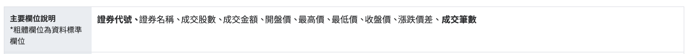
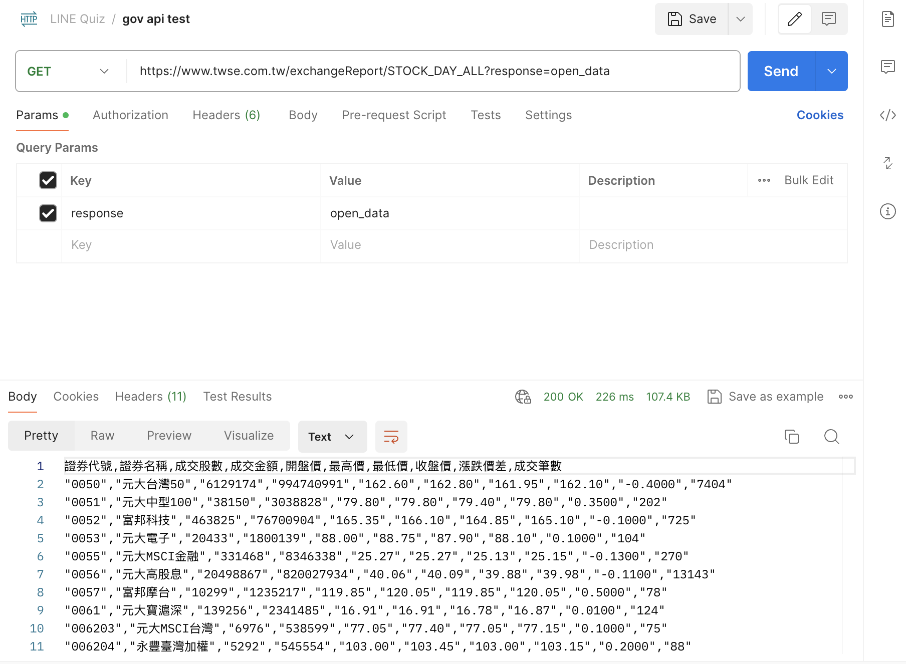
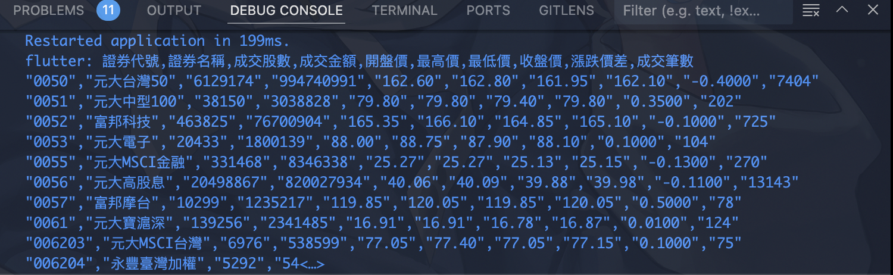
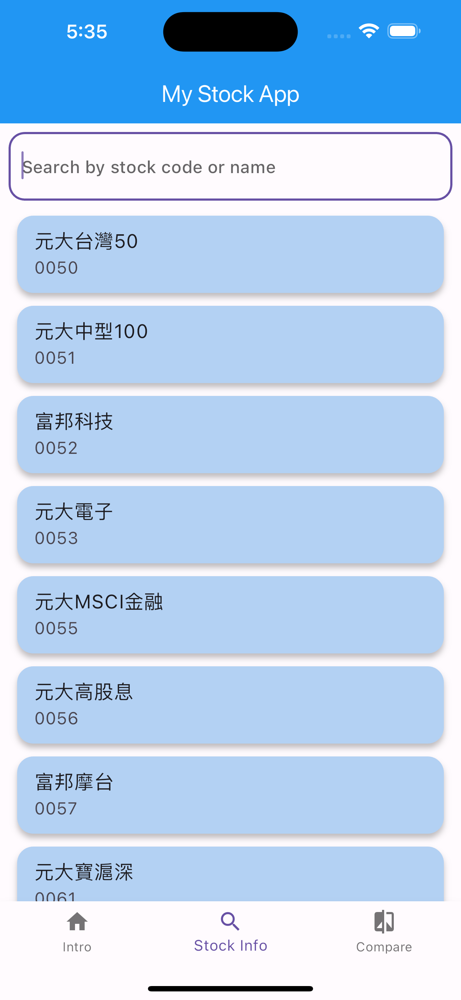
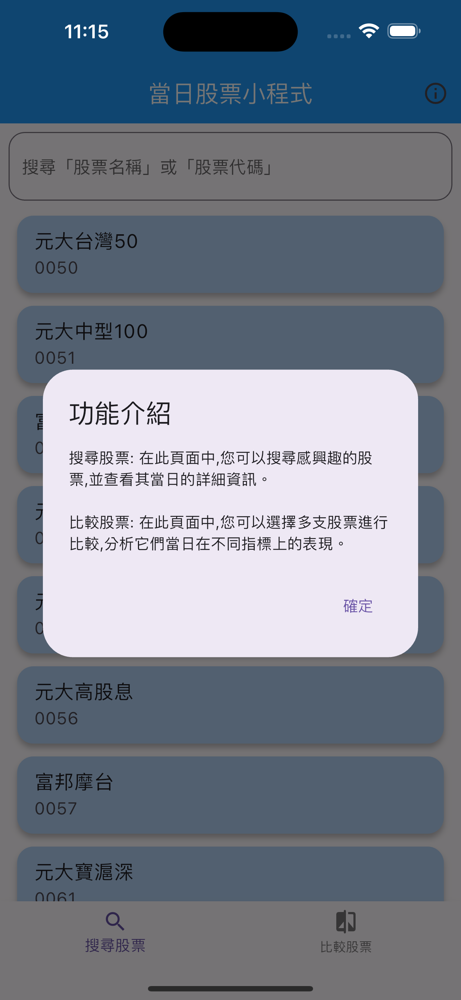
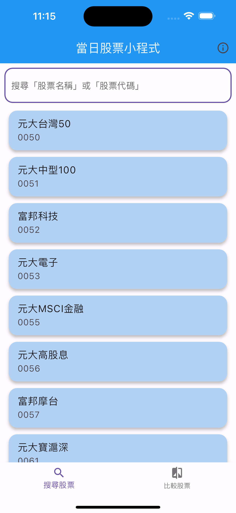
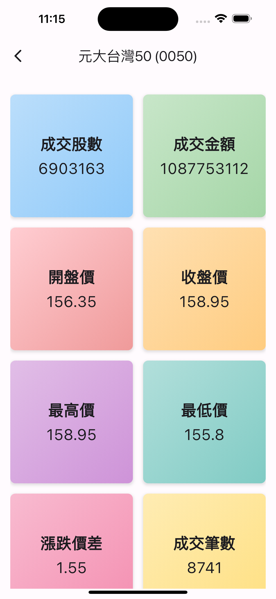
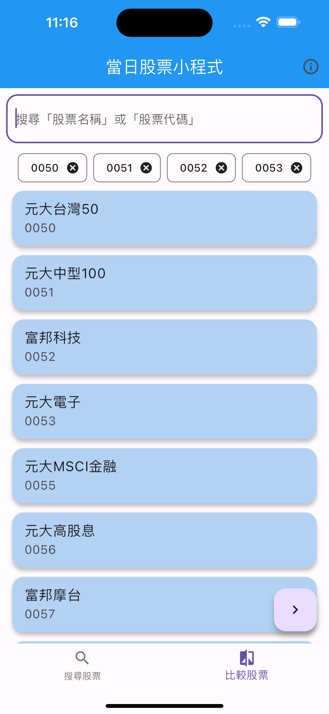
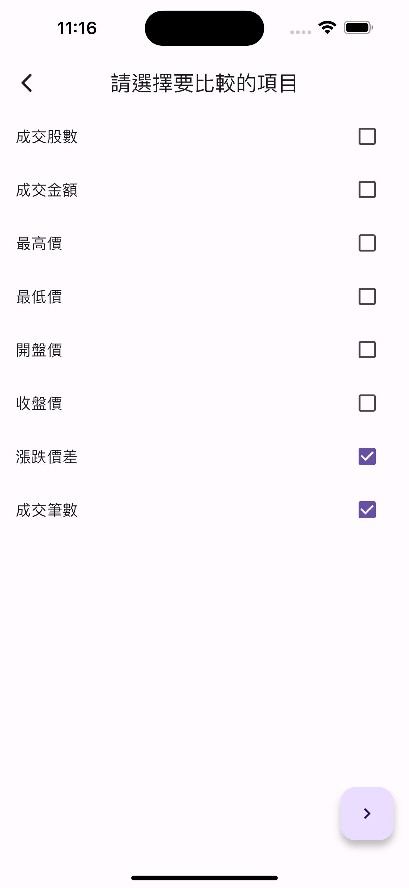
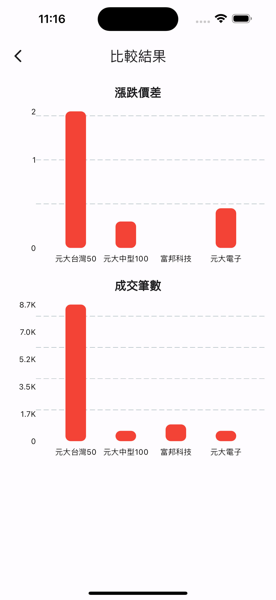

# LINE Intern Quiz

本專案主要在建立一個用於比較股票資訊的手機App，使用來自政府資料開方平台[data.gov.tw](https://data.gov.tw/)的資料。此應用程式允許用戶通過股票代碼或股票名稱搜尋股票，查看當天單個股票的信息，並使用可自定義參數比較多個股票。

## 目錄

1. [資料源](#資料來源)
2. [API 規格](#api-規格)
3. [API 測試](#api-測試)
4. [應用程式功能](#應用程式功能)
5. [UI 設計](#ui-設計)
6. [專案設置](#專案設置)
7. [調用 API 函數](#調用-api-函數)
8. [資料庫](#資料庫)
9. [搜尋股票 UI](#搜尋股票-ui)
10. [比較股票 UI](#比較股票-ui)
11. [測試](#測試)

## 資料來源

該應用程式的資料來源於政府資料開放平台[data.gov.tw](https://data.gov.tw/)，具體來自[https://data.gov.tw/dataset/11549](https://data.gov.tw/dataset/11549)的資料集。

## API 規格

在確定了感興趣的資料集後，觀察並瞭解 API 規格。

## API 測試

使用 Postman 測試 API。

## 應用程式功能

該應用程式的主要功能包括：

1. **搜尋股票**：用戶可以通過股票代碼或股票名稱搜尋股票。
2. **查看股票信息**：用戶可以查看當天單個股票的資訊。
3. **比較股票**：用戶可以比較多個股票，選擇 2 至 4 個股票進行比較，並選擇比較的資訊參數，如開盤價、最高價等。

## UI 設計

UI 計劃包括以下頁面：

1. **查看股票頁面**：允許用戶搜尋股票並查看單個股票資訊。
2. **比較股票頁面**：用戶可以搜尋並選擇多個股票進行比較，選擇資訊參數並查看比較結果。

## 專案設置

初始化專案，並創建 Github 存儲庫以管理程式碼。

## 調用 API 函數

實現並測試調用 API 的函數

## 資料庫

此應用程式使用 SQLite 資料庫以儲存獲取的資料。過程包括創建資料庫（如果不存在）、清理股票資料表、執行 API 調用函數，以及更新股票資料表。

## 搜尋股票 UI

撰寫搜尋股票的 UI 代碼，並使用資料庫的資料進行測試以驗證其功能。

## 比較股票 UI

撰寫比較股票的 UI 代碼，並使用資料庫的資料進行測試以驗證其功能。

## 測試

對應用程式的所有功能進行全面測試，以確保其正常工作。

## App Demo

    
    
    

    
    
    

    

